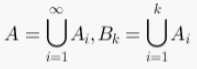
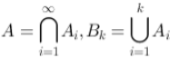
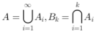
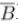
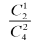
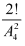

# 概率论MOOC第一章

1. 对某一目标进行射击，直至命中为止，设

    ‎A~i~ = {第i次射击击中目标}，i =1,2, …，

    A = {击中目标}  
    B~k~ = {前*k*次击中目标}，*k*=1,2, …，  
    则下列表达式中哪个是正确的？( )

    * [X] A.​​
    * [ ] B.​​
    * [ ] C.​​
    * [ ] D.​​

‍

2. 以下说法哪个正确？( )

    * [ ] A.如果*A*、*B*是对立事件，则*A*、*B*的差事件*A-B*是不可能事件
    * [ ] B.如果*A*、*B*是互不相容事件，则*A*、*B*一定是对立事件
    * [ ] C.如果*A*、*B*是互不相容事件，则*A*、*B*的差事件*A-B*是不可能事件
    * [X] D.如果*A*、*B*是对立事件，则*A*、*B*一定是互不相容事件

‍

3. 从0，1，2，……，9中有放回抽取4个数字，则数字4至少出现一次的概率  （    ）

    * [ ] A.古典概率
    * [ ] B.0.1
    * [X] C.0.3439
    * [ ] D.0.6561

‍

4. 设A,B为两个随机事件，则下面命题正确的是（     ）

    * [ ] A.如果A，B相互独立，且P(A)P(B)>0, 则与互不相容
    * [ ] B.如果A，B互不相容，且P(A)P(B)>0, 则A,B相互独立
    * [X] C.如果A，B相互独立，则与相互独立
    * [ ] D.如果A，B互不相容，则与也互不相容

‍

5. 下列说法不正确的是（）

    * [ ] A.频率，古典概率，几何概率都具有非负性，规范性和可加性
    * [X] B.频率是变量，所以不能反映事件发生的概率大小
    * [ ] C.古典概率需要随机试验满足基本事件的有限性和等可能性
    * [ ] D.几何概率推广了古典概率样本空间的有限性

‍

6. 事件A与事件B相互独立，且，则等于（    ）

    * [ ] A.0
    * [ ] B.1/4
    * [X] C.未知
    * [ ] D.1

‍

7. 设事件 A = “甲种产品畅销，乙种产品滞销” ，则 A 的对立事件为（       ）

    * [X] A.甲种产品滞销或者乙种产品畅销
    * [ ] B.甲种产品滞销
    * [ ] C.甲、乙两种产品均畅销
    * [ ] D.甲种产品滞销，乙种产品畅销

‍

8. P(A)=0.4，P(B)=0.3，P(AUB)=0.6，求 P(A-B).

    * [ ] A.0.6
    * [X] B.0.3
    * [ ] C.0.4
    * [ ] D.0.1

‍

9. 将两颗球随机投入四个盒子中，则未向前两个盒子投球的概率为（ ）.

    * [X] A.​
    * [ ] B.​
    * [ ] C.​
    * [ ] D.​

‍

10. 抛掷一颗骰子，设 *A*为事件出现点数小于3，*B*为出现奇数点，则下面选项正确的是（）

     * [ ] A.P(AB)=1
     * [ ] B.P(A|B)=0
     * [X] C.P(AB)=P(A)P(B)
     * [ ] D.P(|A)=0

‍

11. 设 A 与B 同时出现时 C 也出现，则(       )

     * [ ] A.AUB 是 C 的子事件
     * [ ] B.C 是 AB 的子事件
     * [ ] C.C 是 AUB 的子事件
     * [X] D.AB 是 C 的子事件
